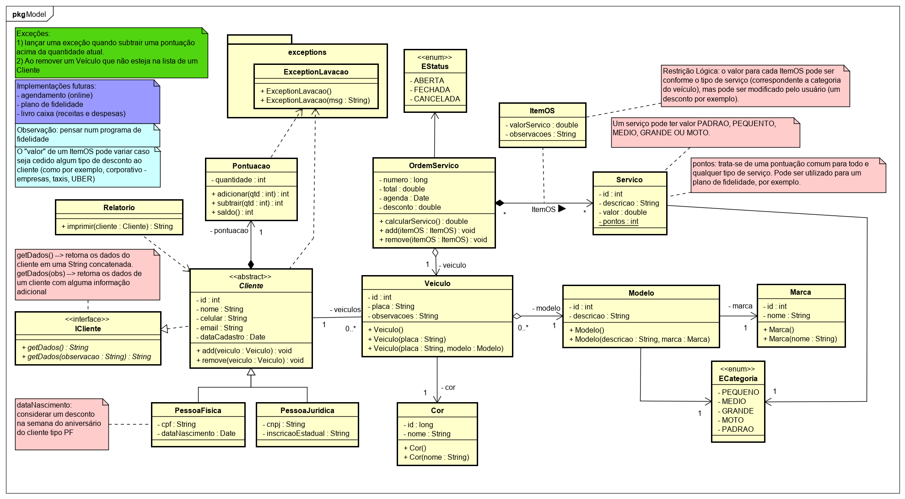
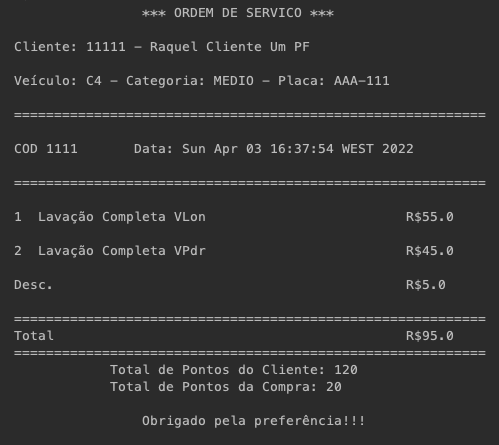
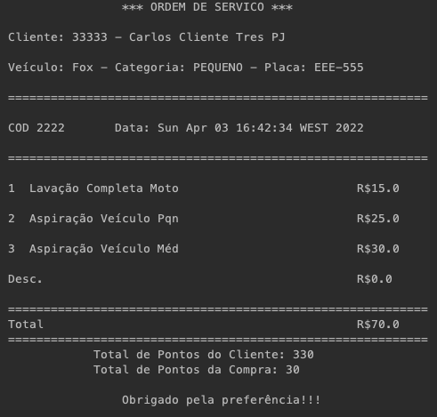
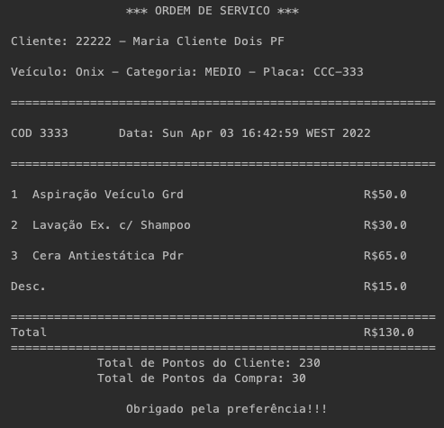

# Complete Car Wash System - OOP Project

In this project I'm sharing my progress studying Oriented Object Programming (OOP) with Java.

## 🚀 Concepts applied

* Inheritence
* Polymorphism
* Abstraction
* Encapsutation
* Interface
* Overloading
* Overriding
* Enumerations
* Static Variables and Static Methods
* Association, Agregation and Composition
* Relationships: OneToMany and ManyToOne
* Exceptions

One MainApp Class and some datasources in mock class format was implemented in order to realize a demonstration. The result is showed in the console.

Prof. Dr. Marcos A. Pisching, OOP Professor at IFSC

## 🚀 Class Diagram followed

## 🚀 Console Output Examples

## 🛠️ Built with

* [Java](https://docs.oracle.com/javase/8/docs/)
* [Netbeans](https://netbeans.apache.org/)

---
⌨️ com ❤️ por [Raquel Darelli Michelon](https://github.com/RaquelMichelon) 😊

